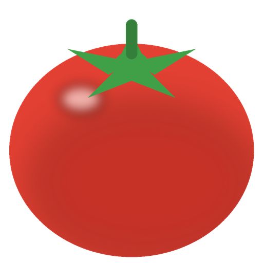
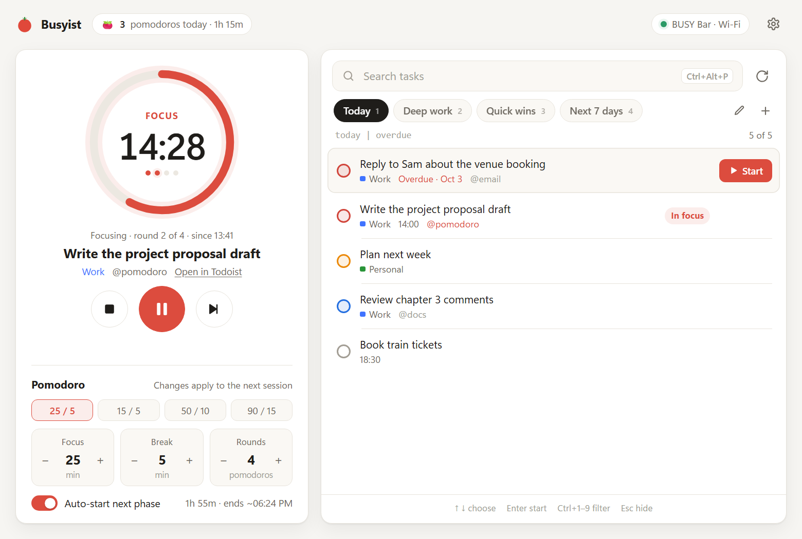

<p align="center"></p>

# Busyist

**Todoist pomodoros on your BUSY Bar.** Busyist is a small Windows tray app: pick a task from
Todoist, and your BUSY Bar runs its focus timer while Busyist keeps track of
what you're working on.



> Unofficial. Busyist is a hobby project and is not affiliated with BUSY or Todoist.

## Download

Get **`Busyist-Setup-x.y.z.exe`** from the [latest release](https://github.com/josedaidone/busyist/releases/latest)
and run it. It installs for your user only (no admin rights needed), adds Busyist to the Start
menu, and starts it.

- **"Windows protected your PC"?** Busyist isn't code-signed yet, so SmartScreen warns on first run.
  Click **More info → Run anyway**. You can check the download against `SHA256SUMS.txt` on the
  release page.
- Prefer no installer? Download the **portable zip**, unzip it anywhere and run `Busyist.exe`.
- Needs Windows 10 or 11 (64-bit) and Microsoft's WebView2 Runtime, which Windows 11 already has.
  The installer adds it if it's missing.

## Set up

1. **Todoist**: in Todoist, open *Settings → Integrations → Developer* and copy your **API token**.
2. **BUSY Bar**:
   - **Over Wi-Fi**: the bar's HTTP API is off by default. Plug the bar in over USB, open
     <http://10.0.4.20>, go to *Network → HTTP API*, turn it on and set a PIN. Then find the bar's IP
     under *Settings → Wi-Fi → (your network) → View IP Address*.
   - **Over USB only**: nothing to do, Busyist also tries the bar's USB address.
3. Start Busyist. The first time, it opens on **Settings**: paste the token, enter the bar's IP and
   PIN, click **Test connection**, then **Save**.

## Using it

- **Pick a task**: click the tray tomato or press the hotkey (default **Ctrl+Alt+P**), then click a
  task or use ↑ ↓ and Enter. The bar starts its interval timer.
- **The hotkey cycles**: window → mini timer only → everything in the tray → window again. If the
  window is open but behind other apps, the hotkey brings it to the front first.
- **Saved filters**: the tabs above the list are Todoist filter queries you name yourself
  ("Today", "Deep work", "Quick wins"...). **+** adds one; the pencil, or a double-click on a tab,
  edits, reorders or deletes it. **Ctrl+1–9** switches between them.
- **Pomodoro**: presets (25/5, 15/5, 50/10, 90/15) or your own focus, break and round counts.
- **While it runs**:
  - the window and a small always-on-top **mini timer** show the task, phase and countdown;
  - the tray icon shows the minutes left (red is focus, green is break, amber is paused);
  - pause, skip and stop work from the window, the mini timer or the tray menu.
- **In Todoist**:
  - starting a task adds a label (default `@pomodoro`, which can be removed again when the
    session ends);
  - finished pomodoros are logged as a comment on the task;
  - when the session ends you can complete the task in one click; it drops off the list, the
    filter reloads, and the ✓ counter in the header shows how many tasks you completed today.
- Closing or minimizing the window sends it to the tray. Busyist starts with Windows; turn that
  off in Settings.

## Privacy

- Busyist talks to two places only: `api.todoist.com` and your BUSY Bar on your own network.
  There is no telemetry and no account.
- Your settings live in `%APPDATA%\Busyist`: `config.json` (including your Todoist token and bar
  PIN, unencrypted), the session, your history and a log. **Settings → About → Open data folder**
  takes you there.
- Uninstalling asks whether to delete that folder too.

## Troubleshooting

- **"Bar offline"**: check the IP and PIN in Settings, and that your PC and the bar are on the same
  network. Some office and guest networks block devices from talking to each other.
- **The hotkey does nothing**: another app may own that combination. Busyist warns about this; pick
  another one in Settings.
- **Something else**: the log at `%APPDATA%\Busyist\busyist.log` usually says why. Please attach it
  to an [issue](https://github.com/josedaidone/busyist/issues). Check it first, since it can contain
  task names.

## Run from source or build it yourself

You need Python 3.11+ on Windows.

```powershell
py -3.11 -m venv .venv
.\.venv\Scripts\python.exe -m pip install -r requirements.txt
.\.venv\Scripts\python.exe busyist.py --show
```

To build the installer and the portable zip into `dist\` (needs [Inno Setup 6](https://jrsoftware.org/isdl.php)):

```powershell
powershell -ExecutionPolicy Bypass -File build.ps1
```

**Releases** are built by GitHub Actions. Bump `__version__` in `busyist.py`, commit, then
push a matching tag:

```powershell
git tag v1.0.1
git push origin v1.0.1
```

Project layout:
- `busyist.py`: the app;
- `ui/`: the window and mini timer (HTML/CSS/JS, shown with pywebview);
- `packaging/`: the PyInstaller spec and the Inno Setup script;
- `tools/`: the icon and license helpers.

## License

[MIT](LICENSE). Busyist bundles third-party components under their own licenses; see
`THIRD_PARTY_LICENSES.txt` in the app folder.
